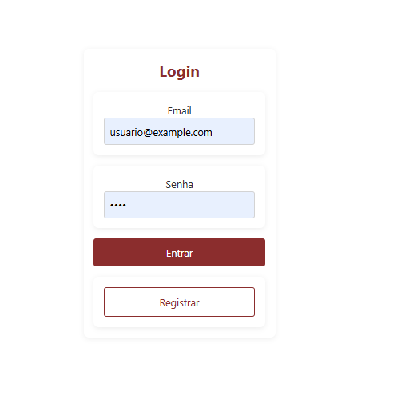
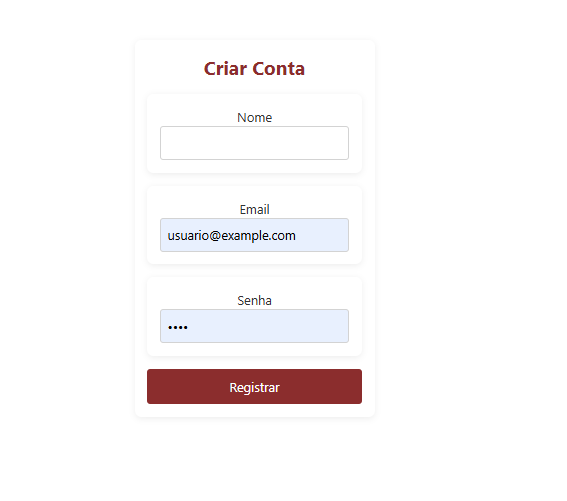
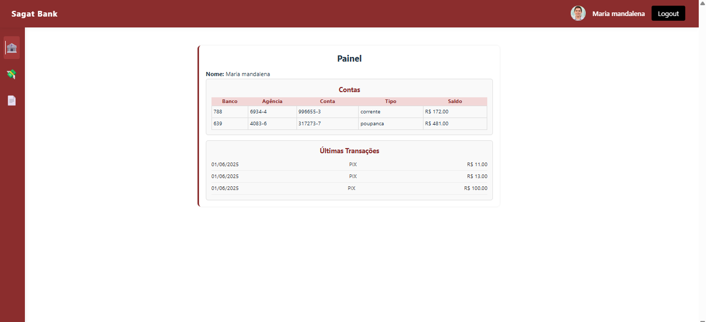
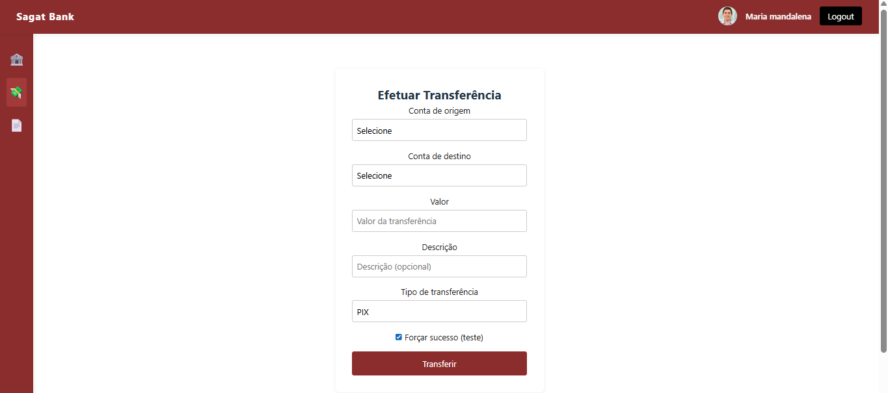
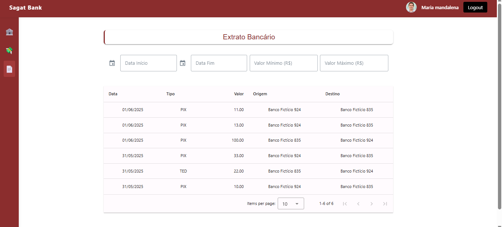

# Sagat Bank Panel

Este é o painel do Sagat Bank, desenvolvido com Vue 3, TypeScript e Vite. O projeto utiliza Vuetify para componentes de UI e Pinia para gerenciamento de estado.

## 🚀 Como rodar o projeto

1. **Clone o repositório:**

   ```bash
   git clone https://github.com/attilamonteiro/sagat-bank-panel.git
   cd sagat-bank-panel
   ```

2. **Instale as dependências:**

   ```bash
   npm install
   ```

3. **Inicie o servidor de desenvolvimento:**

   ```bash
   npm run dev
   ```

4. **Acesse o projeto no navegador:**

   O projeto estará disponível em `http://localhost:5173`.

## ✨ Funcionalidades implementadas

- **Login e Registro:**
  - Login de usuários com autenticação via token.
  - Registro de novos usuários.

- **Painel do Usuário:**
  - Exibição de informações do usuário e contas bancárias.
  - Listagem de transações recentes.

- **Transferências:**
  - Realização de transferências bancárias entre contas.

- **Extrato Bancário:**
  - Filtros por data, valor e tipo de transação.
  - Paginação de resultados.

## 🌐 Endpoints da API utilizados

- **Autenticação:**
  - `POST /auth/login` - Login de usuários.
  - `POST /auth/register` - Registro de novos usuários.

- **Contas Bancárias:**
  - `GET /users/bank_accounts` - Listagem de contas bancárias.
  - `GET /users/bank_accounts/my` - Listagem de contas do usuário.

- **Transferências:**
  - `POST /users/bank_account_transfers` - Realização de transferências.

- **Extrato:**
  - `GET /users/bank_account_transfers/statements` - Listagem de transações com filtros.

## 📸 Prints das telas

### Login



### Criar Conta



### Painel do Usuário



### Transferências



### Extrato Bancário



## 💡 O que eu faria diferente se tivesse mais tempo

- **Testes Automatizados:** Implementaria testes unitários e de integração para garantir a qualidade do código.
- **Melhorias de UI/UX:** Refinaria a interface para torná-la mais intuitiva e responsiva.
- **Documentação:** Criaria uma documentação mais detalhada para desenvolvedores e usuários finais.
- **Internacionalização:** Adicionaria suporte a múltiplos idiomas.
- **Notificações:** Notificações de falhas e sucessos.

---

### 🛠 Tecnologias utilizadas

- **Framework:** Vue 3
- **Linguagem:** TypeScript
- **Gerenciamento de Estado:** Pinia
- **UI:** Vuetify
- **Build Tool:** Vite

---

Para mais informações, consulte a [documentação oficial do Vue 3](https://vuejs.org/).
